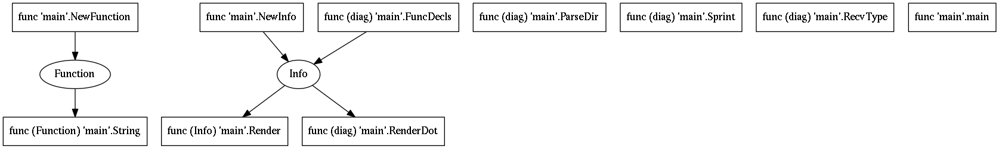

# typediag: go type diagramming

`typediag` is a program that produces a *type diagram* of a go language package.

A type diagram is a graph that shows which types are used by which functions in
the package.  It can be used to understand the relationships between types
in an unfamiliar API.

Here's a sample result of running `typediag` on itself.



# Requirements

Needs the [graphviz][1] package to be installed on your machine.  For example, 
on Ubuntu machines you can install it with:

```console
sudo apt-get install graphviz
```

Installation instructions below assume go 1.11.

# Installation

```console
git install github.com/filmil/typediag/...
```

# Use

```console
typediag --path=/some/directory/containing/go/code --output=$HOME/out.png
```

[1]: http://www.graphviz.org
